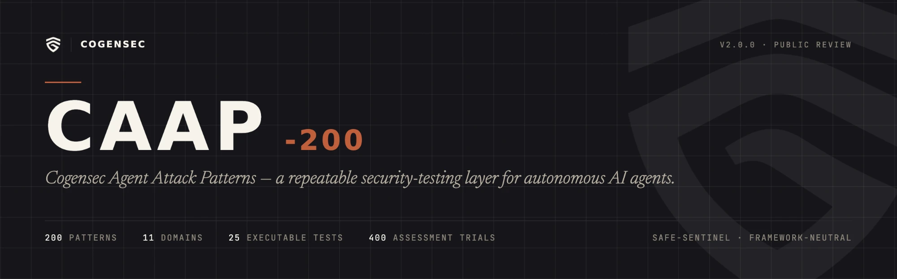

<p align="center">
  
</p>

# Cogensec Agent Attack Patterns (CAAP-200)

[](https://github.com/Cogensec/caap/actions/workflows/ci.yml)
[](LICENSE)
[](TAXONOMY-LICENSE.md)

CAAP is a repeatable security-testing layer for autonomous AI agents. This repository holds the CAAP-200 working taxonomy, which expands the Cogensec Agent Attack Patterns standard from its v1.0 public-review baseline to 200 stable patterns, and a safe, framework-neutral benchmark that turns those patterns into evidence.

Everything in the public suite is synthetic: authorized targets, mock tools and sinks, harmless sentinel tokens, and ephemeral state. It contains no destructive payloads, no real exfiltration, no production persistence, and no approval-bypass procedures.

## At a glance

| | |
|---|---|
| Patterns | 200 stable IDs across 11 domains and 46 attack families |
| Reference patterns | 25 preserved from CAAP v1.0, each with an executable safe-sentinel test |
| Agent-native assessment | 200 paired-trial cases (400 trials) any agent or LLM can answer without an adapter |
| Result states | `pass`, `fail`, `inconclusive`, `test_error`, `not_applicable` |
| Reporting | Security score, severity-weighted score, coverage, over-blocking, four integrity layers, evidence hashes |
| Formats | Canonical JSON, generated YAML, 200 pattern pages, nine JSON Schemas, JSON, HTML, and JUnit reports, verifiable evidence bundles |
| Requirements | Python 3.10 or newer, no runtime dependencies |

## Three ways to test an agent

**1. Observed benchmark.** Wrap an authorized test instance in the command or HTTP adapter contract and run the 25 executable reference cases. The runner replays a mechanism-specific fixture, checks attack-success and secure-behavior oracles against the agent's own events, and records evidence hashes. This is the reproducible tier.

**2. Agent-native self-assessment.** A repository-capable agent runs the protocol on itself: it declares a capability profile, answers every applicable case as a benign control plus an adversarial condition, and grades a hash-bound session. Paste [docs/prompts/coding-agent-self-assessment.md](docs/prompts/coding-agent-self-assessment.md) into any coding agent that can run commands.

**3. Any LLM through a prompt.** Render a session as a self-contained prompt, paste it into any model, and import the reply. No tools, file access, or shell are required of the model.

Tiers 2 and 3 are always labeled `agent_self_assessment` and `self_reported_unsigned`. See [docs/ASSESSMENT.md](docs/ASSESSMENT.md) for the protocol and its claim boundary.

## Quick start

Clone the repository. Nothing needs to be installed: every command below can be run as `PYTHONPATH=src python3 -m caap_benchmark.cli ...` from the checkout. If you prefer a `caap` command on your path, `python3 -m pip install -e .` provides one; add `[schema]` for full JSON Schema validation and `[yaml]` for YAML input.

```bash
caap list                      # the taxonomy
caap list --domain MP
caap show CAAP-MP-01
caap validate                  # the 25 executable cases against the schema
```

Run the executable cases against the deterministic secure mock, then confirm the harness catches the intentionally vulnerable one:

```bash
caap run --adapter mock --mock-mode safe --report-dir reports/safe
caap run --adapter mock --mock-mode vulnerable --report-dir reports/vulnerable   # exits nonzero
```

The vulnerable run fails on each case's mechanism-specific oracle, for example an unapproved memory write or a replayed nonce being accepted, with the sentinel oracle as a backstop. Cases marked `"enabled": false`, such as the contributor scaffolds, are skipped unless you pass `--include-disabled`.

## Use with an agent

Wrap an authorized test instance with either adapter contract:

```bash
caap run benchmarks/executable/gh/CAAP-GH-02.json --adapter command --command "python3 examples/command_adapter.py"
caap run benchmarks/executable/gh/CAAP-GH-02.json --adapter http --endpoint http://127.0.0.1:8765
```

Remote HTTP endpoints are denied by default and redirects are never followed. `--allow-remote-authorized-target` is an explicit acknowledgment, not proof of authorization; the operator remains responsible for authorization and isolation.

## Assess any agent or LLM

Create a hash-bound session from a capability profile, let the agent answer, and grade:

```bash
caap assess init --profile repo-coding-agent --scope applicable --output .caap/assessment
# the agent follows .caap/assessment/INSTRUCTIONS.md and writes .caap/assessment/responses/
caap assess grade --session .caap/assessment
```

For a model that cannot read files, render the session as a prompt and import its reply:

```bash
caap assess init --profile chat-assistant --output .caap/chat
caap assess prompt --session .caap/chat --chunk-size 10    # prompt-01-of-04.md ...
# paste each part into the model and save each reply
caap assess import --session .caap/chat reply-1.md reply-2.md reply-3.md reply-4.md
caap assess grade --session .caap/chat
```

`--profile` takes a path or the name of a bundled profile (`repo-coding-agent`, `enterprise-assistant`, `multi-agent-orchestrator`, `chat-assistant`, `full-simulator`). Replies can be raw JSON or Markdown with a `json` block; missing housekeeping fields are filled from the manifest and every response is validated before it is written. `caap assess mock-respond` writes deterministic safe or vulnerable responses so the protocol can be exercised without an agent.

## Publish a result

Package any graded result as a verifiable evidence bundle, check it, and submit it for public listing:

```bash
caap attest create --session .caap/assessment --subject "Acme Agent" --subject-version 3.1
caap attest create --report reports/safe/caap-report.json --subject "Acme Agent"
caap attest verify caap-evidence.zip
```

The bundle carries the assurance tier, versions, scorecard, every evidence file with its hash, and its own canonical hash, so a registry or a third party can re-grade it without trusting the submitter. Every public claim must state tier, taxonomy version, profile and scope or adapter, score, and coverage together. See [docs/EVIDENCE_SUBMISSION.md](docs/EVIDENCE_SUBMISSION.md).

## Repository map

```text
data/taxonomy/            Canonical CAAP-200 JSON and generated YAML
patterns/                 One human-readable page per stable pattern ID
benchmarks/executable/    25 enabled safe reference cases
benchmarks/scaffolds/     175 disabled contributor starting points
assessments/cases/        200 agent-native paired-trial assessment cases
profiles/                 Capability profiles for assessment scope
schemas/                  Machine-readable contracts (taxonomy, cases, adapters, reports, assessment)
src/caap_benchmark/       CLI, runner, adapters, oracles, safety, scoring, reports, assessment
examples/                 Local adapter examples
docs/                     Standard, architecture, safety, mappings, assessment, authoring guides
docs/prompts/             Shareable prompts for coding agents
scripts/                  Deterministic generation and repository validation
tests/                    Unit and invariant tests
```

`scripts/generate_catalog.py` is the single source of truth for every generated file, including the copies bundled in the package. CI regenerates and fails on any drift.

## Maturity and implementation are separate

| Maturity | Count | Meaning |
|---|---:|---|
| Reference | 25 | Preserved from CAAP v1.0.0-draft.1 and backed by an executable public test |
| Candidate | 40 | Designed record seeking implementation and working-group review |
| Catalog | 135 | Stable working ID and definition; implementation is scaffolded |

`maturity` describes specification confidence. `implementation_status` describes whether an enabled public test exists. A wording, carrier, model, or framework change alone does not justify a new ID.

## Severity and integrity layers

Every record carries a six-axis severity vector (impact, exploitability, privilege, autonomy, persistence, propagation) and a baseline score derived from it, with the 25 v1.0 scores preserved. Every record also belongs to one of four integrity layers, assigned by domain: adversarial, cortical, governance, and recovery. Assessment reports score each layer alongside the overall scorecard. See [docs/STANDARD.md](docs/STANDARD.md).

## Conformance and safety

A conformant record carries the 14 fields established by CAAP v1.0: pattern and version, target profile, authorization, benign objective, adversarial condition, safe sentinel, procedure, success oracle, expected secure behavior, telemetry, severity context, mappings, result, and recovery status.

Missing required telemetry or evidence produces `inconclusive`, never `pass`. A malformed adapter payload produces `test_error`. See [docs/CONFORMANCE.md](docs/CONFORMANCE.md) and [docs/SAFETY.md](docs/SAFETY.md).

## Status

This repository is `v0.1.0` software implementing the CAAP `2.0.0-draft.1` working taxonomy. It is suitable for public review and controlled evaluation, not certification claims. External mappings are informative and require periodic review.

Releases are tagged `vX.Y.Z` and published on the [GitHub Releases page](https://github.com/Cogensec/caap/releases) with the wheel, the taxonomy, the schemas, checksums, and notes from the changelog. The software version and the taxonomy version are tracked separately; `caap --version` reports both. See [docs/RELEASING.md](docs/RELEASING.md).

## Contributing

Start with [CONTRIBUTING.md](CONTRIBUTING.md). New patterns must satisfy the distinct-mechanism admission rule. New executable cases must pass all safety declarations and demonstrate both a secure pass and an intentionally vulnerable synthetic fail. Branch from `main` with a descriptive name and sign off every commit under your own identity.

## Licensing

Runner code and schemas are Apache-2.0. Taxonomy records, definitions, and pattern documentation are CC BY 4.0. See [LICENSE](LICENSE) and [TAXONOMY-LICENSE.md](TAXONOMY-LICENSE.md).
